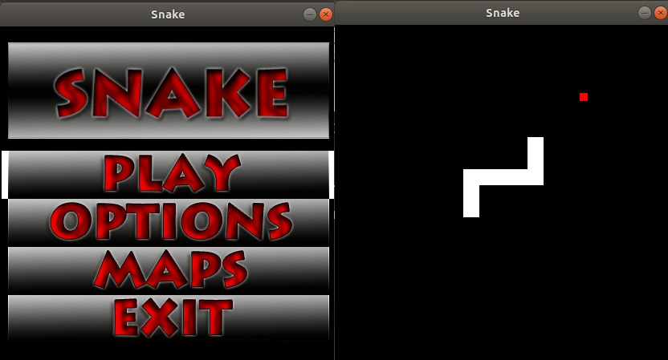

# Snake Game

## Build the project

- Install SDL: `sudo apt-get install libsdl1.2-dev`
- Install build essential: `sudo apt install build-essential`
- Make the project: `make`

## Run the project

Run the binary generated. Select the menu with the Space bar and navigate
using the arrow keys: `./Snake`

